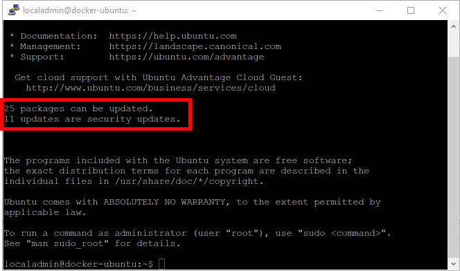

## Overview
We have just created our Ubuntu server.  We now need to apply any available system updates along with installing and configuring Docker to begin working with containers.

## Install Updates
Just like any other operating system, updates are periodically released to support new features and patch any potential security threats.  We will apply the updates first.

  1. If you have not already, connect to your remote Ubuntu server and login.

  2. From the login prompt, you may see a status of available updates. (If not, don't be too alarmed - continue with these steps anyway just to be sure.)  
  

  3. First we need to ensure our list of sources for our system updates are up-to-date. From the command prompt, type the following:
  ```bash
  sudo apt-get update
  ```
  
  4. Now we can install updates.  From the command prompt, type the following to automatically install all available updates:
  ```bash
  sudo apt-get upgrade -y
  ```

  5. Depending on the number and size of available updates, this process may take a few minutes.  Now would be a good time to take a break.